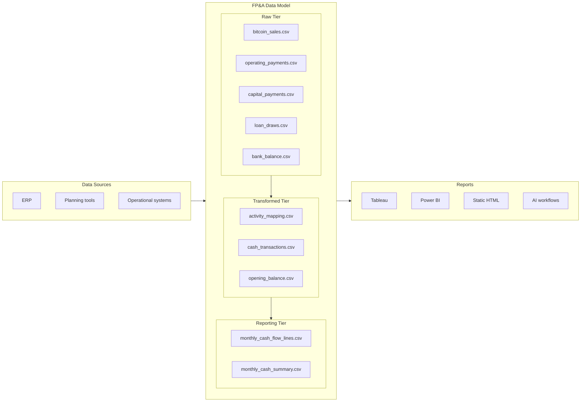

# Rolling cash flow forecast

## 1. Overview

This report is a picture of cash going in and out of one fictional site as it moves from Bitcoin mining to a data center. The numbers are examples, not a live company feed. Raw extracts cover Bitcoin sales, operating bills, capital payments, loan draws, and the bank balance. Those pieces are tidied so months and dollars line up, then named the way a cash-flow statement does (day-to-day operations, building the facility, money from lenders). The Forecast tab shows that management cash flow view — not a GAAP statement — with a chart, monthly table, and drilldown to source transaction IDs.

Then open the **Data process** tab in `cashflow-forecast.html` to see the full tables. Column details are in `data/raw/README.md`.

| System | Files | Grain | Payload |
| --- | --- | --- | --- |
| Treasury / exchange | `bitcoin_sales.csv` | Settled sale | BTC sold, USD received |
| Accounts payable | `operating_payments.csv` | Paid invoice | Mining power and overhead cash paid |
| Capital projects / AP | `capital_payments.csv` | Paid invoice | Data center buildout and mining equipment |
| Treasury / loan system | `loan_draws.csv` | Funded draw | Construction-loan draws |
| Bank export | `bank_balance.csv` | Account snapshot | Opening available cash |

## 2. Data Model



Data Sources – ERP, planning tools, and operational systems provide the original records.

Raw Tier – Data captured by operational systems in its original format, before business rules are applied.

Transformed Tier – Data is validated, cleaned, standardized, and mapped to consistent business definitions. Records retain a link to their sources.

Reporting Tier – Transformed data is aggregated into metrics and tables designed for dashboards, analysis, and decision-making.

Reports – Reports can use any tools on top of the foundation data model (i.e. Tableau, Power BI, static HTML, and AI workflows).

The SQL transform keeps eligible settled, paid, and funded events, maps them through `activity_mapping.csv`, and writes one cash-activity row per transaction. Opening cash is stored separately and is not a cash-flow event. Column details are in `data/transformed/README.md`.

| Table | Grain | Keys / measures |
| --- | --- | --- |
| `data/transformed/activity_mapping.csv` | Source × category | business activity, cash-flow section, reporting line |
| `data/transformed/cash_transactions.csv` | Eligible cash event | `transaction_id`, `cash_date`, `reporting_month`, `signed_amount_usd` |
| `data/transformed/opening_balance.csv` | Account snapshot | `available_balance_usd` |

Rebuild with DuckDB SQL (`scripts/sql/`):

```
python scripts/run_sql.py
```

## 3. Semantic Layer

Business names sit in the mapping, not in the source systems. The Forecast tab’s Operating / Investing / Financing rows are this layer. Bitcoin sale proceeds are treated as operating cash receipts in a management cash flow view.

| Category | Inflow | Outflow |
| --- | --- | --- |
| Operating Activities | Mining cash received | Mining power paid + overhead paid |
| Investing Activities | None in this actuals set | Data center buildout paid + mining equipment paid |
| Financing Activities | Construction loan drawn | None in this actuals set |

- Net operating = mining receipts + power paid + overhead paid.
- Net investing = buildout paid + equipment paid.
- Net financing = loan draws.
- Net change in cash = operating + investing + financing.
- Ending cash = beginning cash + net change.

## 4. Reporting

The reporting tier is CSV files in `data/reporting/`. The Forecast tab fetches `monthly_cash_summary.csv` and `monthly_cash_flow_lines.csv`, and drills into `data/transformed/cash_transactions.csv` by `reporting_month` and `reporting_line`.

| Reporting file | What is kept | Used for |
| --- | --- | --- |
| `monthly_cash_flow_lines.csv` | Signed amount by month and reporting line | Statement lines and drilldown keys |
| `monthly_cash_summary.csv` | Section nets, beginning and ending cash | Chart totals and cash roll-forward |

Serve the folder and open the dashboard:

```
python -m http.server 8000
```

Then open [http://localhost:8000/cashflow-forecast.html](http://localhost:8000/cashflow-forecast.html).
