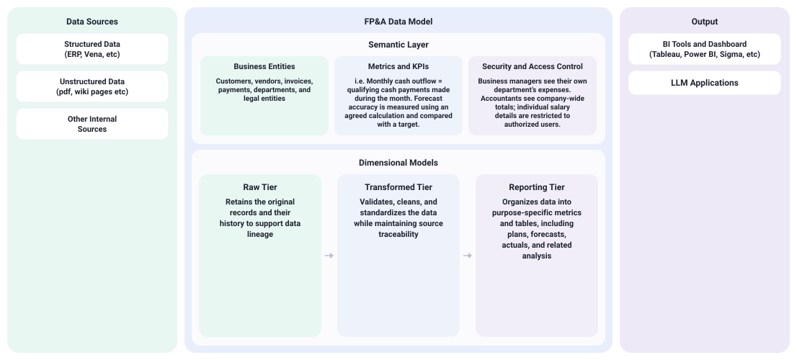

# Rolling cash flow forecast

## 1. Overview

This project demonstrates how fragmented financial data can become a **consistent, traceable cash-flow forecast** for a fictional business transitioning from Bitcoin mining to a data center. The dashboard includes a **Data Flow** tab explaining how the numbers are prepared and checked, followed by a **Forecast** tab showing the financial results.

- **Data sources:** Bitcoin sales, operating payments, capital expenditures, loan draws, and bank balances.
- **Data model:** Raw records are cleaned, validated, standardized, and organized into reporting tables.
- **Shared definitions:** A semantic layer standardizes cash-flow categories and calculations, allowing teams to use consistent business logic for their analytics while retaining the flexibility to create their own reports.
- **Governance and transparency:** Users can trace reported figures to individual transactions and explore how duplicate records and unmapped categories are handled.
- **Forecasting:** SQL combines January–September actuals with October–December forecasts to calculate monthly cash movements and balances.

**This project presents a general concept to illustrate the approach. It is not a detailed architectural design, which would typically specify technology choices, engineering methodologies, and implementation details.**

## 2. Data Model

Financial data flows from source systems through a cloud-based data pipeline with three tiers: the **Raw Tier** preserves original records and their history to support data lineage; the **Transformed Tier** validates, cleans, and standardizes the data while maintaining traceability to its sources; and the **Reporting Tier** organizes the data into purpose-specific metrics and tables, with actuals and forecasts stored in separate files. This shared, governed data foundation supports both BI tools and LLM applications. Visit the [data directory on GitHub](https://github.com/janebugai/rolling-cashflow-forecast/tree/main/data) to explore the mock-up data model.



**Data Sources** — Structured Data (ERP, Vena, etc.), Unstructured Data (pdf, wiki pages, etc.), and Other Internal Sources.

**FP&A Data Model**

Semantic Layer

| | |
| --- | --- |
| Business Entities | Customers, vendors, invoices, payments, departments, and legal entities |
| Metrics and KPIs | Monthly cash outflow = qualifying cash payments made during the month. Forecast accuracy is measured using an agreed calculation and compared with a target. |
| Security and Access Control | Business managers see their own department’s expenses. Accountants see company-wide totals; individual salary details are restricted to authorized users. |

Dimensional Models

| Tier | What it keeps |
| --- | --- |
| Raw Tier | Retains the original records and their history to support data lineage |
| Transformed Tier | Validates, cleans, and standardizes the data while maintaining source traceability |
| Reporting Tier | Organizes data into purpose-specific metrics and tables, with actuals and forecast kept as separate files |

**Output** — BI Tools and Dashboard (Tableau, Power BI, Sigma, etc.), Static Reports, and LLM Applications.

## 3. Semantic Layer

The semantic layer centralizes business definitions, dimensions, and calculation rules so they can be reused across reports. In this design, shared SQL views define cash-flow classifications and measures such as cash inflows, cash outflows, and net cash movement, with the underlying code maintained in GitHub.

For example, a **Tableau published data source** makes these definitions available to everyone building connected dashboards. Teams use shared dimensions such as “Reporting Month,” “Cash-Flow Category,” and “Actual / Forecast,” along with approved calculations.

| Shared dimension: Cash-Flow Category | Example transactions |
| --- | --- |
| Operating | Electricity and other operating payments |
| Investing | Equipment purchases and capital expenditures |
| Financing | Loan proceeds and principal repayments |

The **Finance team** can use this dimension to summarize monthly cash flow by category, while the **Operations team** uses it to review individual payments. Both reports apply the same classifications, while each team chooses its own layout, filters, and level of detail. This maintains consistent business definitions while giving teams the flexibility to create their own views, dashboards, and reports. Other tools can also reuse the underlying SQL views.

**The semantic layer also provides essential business context for AI.** It gives AI workflows access to approved definitions, relationships, and calculation rules—for example, what counts as a cash inflow and which periods contain actuals versus forecasts. Without this context, AI may misinterpret fields, apply inconsistent calculations, or invent definitions and unsupported figures. Connecting AI workflows to shared models and requiring answers to use queried results helps keep responses consistent with reporting tools. Validation and traceability to source data remain necessary to verify accuracy.

## 4. Data Governance

Follow two source payments, `PAY-MIN-EQ-2026-02` and `INV-PWR-2026-02`, from the original record through shared rules and quality checks. Finance owns definitions; Operations resolves source-payment questions; Technology maintains the pipeline and checks. Amounts and totals are read from the sample files.

1. **Original record.** Original details are kept so Finance can always trace a reported number back to its source. The step shows each payment’s ID, vendor, payment date, source category, amount, and status.
2. **Shared rules.** Finance approves the rules; Technology maintains their implementation. Each original record is shown next to its shared classification: reporting month, transaction type, cash-flow category, business activity, and reporting line.
3. **Quality checks.** The sample payments pass checks that transaction IDs are present and unique, that each payment matches the shared mapping, and that the transactions behind its monthly reporting line sum to the reported amount. Two examples show how the same checks treat a problem. They are not in the sample files: a duplicate record is rejected, and an unmapped category is rejected.
4. **Governance.** Finance defines how cash flows are classified, such as Operating and Investing, while Operations reviews payments by business activity, such as Bitcoin mining operations, and resolves questions about the source data. Technology maintains the pipeline and validation checks that support both teams. This shared foundation lets each team analyze the data from its own perspective while arriving at consistent numbers when using the same scope and reporting period.

Serve the folder and open the dashboard:

```
python -m http.server 8000
```

Then open [http://localhost:8000/cashflow-forecast.html](http://localhost:8000/cashflow-forecast.html).
